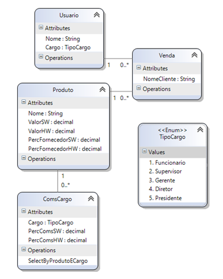

Instituto Fenacon
=================

Autoridade Certificadora (AC), o Instituto Fenacon, denominado Fenacon CD, gerencia, renova, revoga e emite Certificado Digital para pessoas físicas e jurídicas. Criada em 2010, está habilitada pela Receita Federal do Brasil e de acordo com as normas da Infraestrutura de Chaves Públicas Brasileira (ICP-Brasil).

A Fenacon CD nasceu da parceria com a Certisign Certificadora Digital S/A, responsável pelo suporte tecnológico. Firmado em 2006, o acordo deu início ao processo de credenciamento da AC Fenacon-Certisign no Instituto Nacional de Tecnologia da Informação (ITI). Nesse período, começou também a emissão de Certificados na rede de associados do Sistema Fenacon Sescap/Sescon.

Enquanto Autoridade Certificadora, a Fenacon CD está apta a credenciar Autoridades de Registro (ARs) e ainda oferece dois tipos de certificação: A1, com validade de um ano e com armazenamento direto no computador; e A3, que pode ter validade de um a três anos e requer um hardware específico para ser armazenado.

Com sede em Brasília e pontos de atendimento espalhados em todo o país, a Fenacon CD se empenha para que os benefícios da Certificação Digital estejam cada vez mais ao alcance do cidadão brasileiro. Afinal, o Certificado auxilia no cumprimento de uma série de obrigações com órgãos do governo, permite a emissão de notas fiscais e facilita o acesso a serviços como cartórios, laboratórios e bancos. Sempre com garantia de autenticidade e segurança.

Teste Prático - Programador C# (MVC)
------------------------------------
**História**

Cada usuário tem um cargo, entre os seguintes: Funcionário, Supervisor, Gerente, Diretor e Presidente. No entanto, somente usuários com cargo ‘Funcionário’ fazem vendas.

Cada cargo tem uma porcentagem de comissão do valor de cada produto vendido, sendo que o funcionário recebe o valor integral de sua comissão pelos produtos que ele mesmo vendeu, enquanto os outros cargos recebem comissões por todas as vendas, dividido entre o número de usuários do mesmo cargo.

Além disso, o fornecedor também recebe uma parte do valor dos produtos vendidos.

Por último, o valor dos produtos está dividido entre valor de Software e valor de Hardware, e cada comissão entre Cargo x Produto reflete essa separação de valores.

**_Por exemplo:_**

Se o funcionário ‘A’ vende um computador e o funcionário ‘B’ vende um celular, ‘A’ recebe o valor total da comissão relativa à “Funcionário x Computador”, enquanto ‘B’ não recebe nada por essa venda; e ‘B’ recebe o valor total da comissão relativa à “Funcionário x Celular”, enquanto ‘A’ não recebe nada por essa venda.

Supondo dois Supervisores, ‘C’ e ‘D’, ambos receberão a quantia relativa à ‘Supervisor x Computador’ + ‘Supervisor x Celular’, dividido por 2 (que é o número de Supervisores existentes).

**Requisito**

Precisamos criar uma tela que mostre os valores que cada usuário deve receber (Valor relativo a Software, Valor relativo a Hardware e o Total); e, separadamente, o valor de repasse que deve ser pago ao fornecedor dos produtos (também separadas em Software, Hardware e Total). Você deve criar essa tela usando o projeto e estado do banco dados de forma que atenda as especificações.

**Modelo de dados**

Foi utilizado SQL Server como banco de dados. Para criar as tabelas banco de dados utilize o script _DbModel/CreateTable.sql_. Para popular, o arquivo _DbModel/InitialData.sql_.

**Ambiente de desenvolvimento**

Você deve clonar este projeto. Nele há um arquivo de configuração do projeto (_IFEN.CSharp.TestePratico/appsettings.json_), onde é configurada a conexão com o Banco de Dados e algumas classes de comunicação com o mesmo.

Este projeto pode ser editado e executado no Visual Studio Code e 2017 e utiliza .Net Core 2.0 e Entity Framework Core.
* [Visual Studio Code](https://code.visualstudio.com/)
* [Visual Studio 2017](https://www.visualstudio.com/pt-br/downloads/)
* [.Net Core 2.0](https://blogs.msdn.microsoft.com/dotnet/2017/08/14/announcing-net-core-2-0/)
* [Entity Framework Core 2.0](https://blogs.msdn.microsoft.com/dotnet/2017/08/14/announcing-entity-framework-core-2-0/)

Ah! E o Git :D
* [Git](https://git-scm.com/)